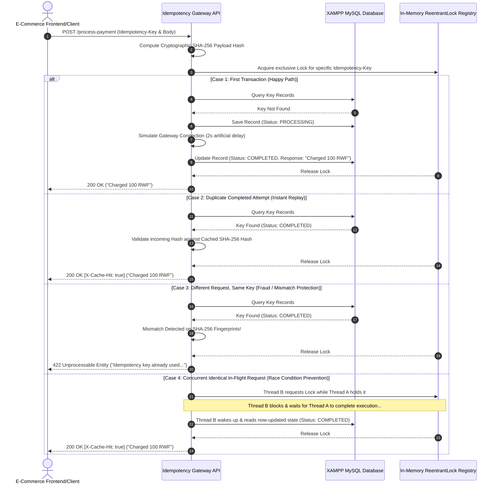

# Idempotency-Gateway (The "Pay-Once" Protocol)

An advanced, production-ready Idempotency Layer middleware built using **Spring Boot 3.5.x** and **Java 17** for **IgirePay Technologies Ltd.** This service guarantees end-to-end safe payment transactions, eliminating double-charging anomalies caused by network latencies, unexpected duplicate user requests, or concurrent race conditions.

---

## 🏗️ System Architecture Flowchart



---

## 🛠️ Design Decisions & Innovations

### 1. The Concurrency Strategy (`ReentrantLock` + `ConcurrentHashMap`)
To fulfill the **Bonus User Story** without degrading performance, an in-memory `ConcurrentHashMap` tracks thread-level `ReentrantLock` objects assigned to specific active keys. This allows completely independent keys to process asynchronously in parallel while strictly serializing overlapping threads trying to modify the same transaction profile simultaneously.

### 2. Developer's Choice Innovation: Cryptographic SHA-256 Fingerprinting
* **Problem Solved**: Storing massive raw JSON transaction bodies inside databases exhausts storage quickly and raises heavy compliance privacy hazards regarding financial records exposure.
* **Implementation**: The incoming payment parameters are run through an immutable `SHA-256 MessageDigest` signature processor. The database only preserves a lightweight 64-character hash footprint string. This ensures $O(1)$ lookup matching and completely shields the server against payload tampering fraud.

---

## 🚀 Setup & Local Installation

### Prerequisites
* **Java Development Kit (JDK 17 or higher)**
* **XAMPP Control Panel** (Apache & MySQL services active)

### Configuration Instructions
1. Ensure your local XAMPP MySQL environment is actively running on standard port `3306`.
2. Clean and build the compilation package using the embedded Maven wrapper:
   ```bash
   ./mvnw clean compile
   ```
3. Start the application instance engine:
   ```bash
   ./mvnw spring-boot:run
   ```
   *(Note: The system connects automatically and instantiates its own database tables using safe database checks; no manual schema setups are required inside phpMyAdmin).*

---

## 📊 API Documentation & Test Scripts

### Endpoint Overview
* **URL**: `http://localhost:8080/process-payment`
* **Method**: `POST`
* **Headers Required**:
  * `Idempotency-Key`: `unique-string-identifier-token`
  * `Content-Type`: `application/json`

### Test 1: First Transaction (User Story 1)
```bash
curl -X POST http://localhost:8080/process-payment \
  -H "Idempotency-Key: test-key-001" \
  -H "Content-Type: application/json" \
  -d '{"amount": 100, "currency": "RWF"}'
```
* **Expected Behavior**: Server pauses for 2 seconds. Returns `200 OK` with body text: `"Charged 100 RWF"`.

### Test 2: Instant Replay Cache Hit (User Story 2)
```bash
curl -i -X POST http://localhost:8080/process-payment \
  -H "Idempotency-Key: test-key-001" \
  -H "Content-Type: application/json" \
  -d '{"amount": 100, "currency": "RWF"}'
```
* **Expected Behavior**: Returns **immediately** with zero delay. The response contains the custom tracking marker header `X-Cache-Hit: true`.

### Test 3: Payload Tampering/Fraud Check (User Story 3)
```bash
curl -X POST http://localhost:8080/process-payment \
  -H "Idempotency-Key: test-key-001" \
  -H "Content-Type: application/json" \
  -d '{"amount": 500, "currency": "RWF"}'
```
* **Expected Behavior**: Returns `422 Unprocessable Entity` with JSON message body: `"Idempotency key already used for a different request body."`
